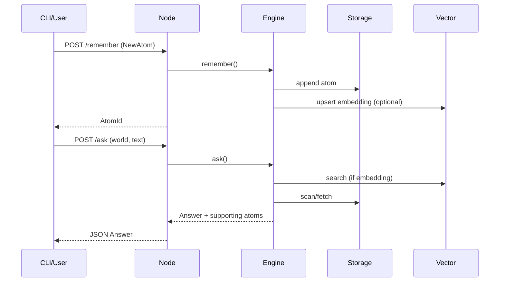

# DWBase Architecture

```mermaid
graph TD
    CLI[dwbase-cli] -->|HTTP/JSON| Node[dwbase-node (Axum)]
    Node --> Engine[DWBaseEngine]
    Engine --> Storage[Sled Storage]
    Engine --> Vector[HNSW Vector Index]
    Engine --> Stream[Local Stream Engine]
    Engine --> Gatekeeper[Security/Capabilities]
    Engine --> Embedder[Dummy Embedder]
    Engine --> Metrics[Tracing/Metrics Facade]
```



Key flows:
- **Remember**: gatekeeper checks caps → optional embedding → vector upsert → sled append → reflex/stream update.
- **Ask**: reflex prefilter → fallback storage scan → optional vector search → dedupe/rerank → answer.
- **Replay**: storage scan with filters.
- **Inspect**: storage lookup by id via node `/atoms/{id}`.
